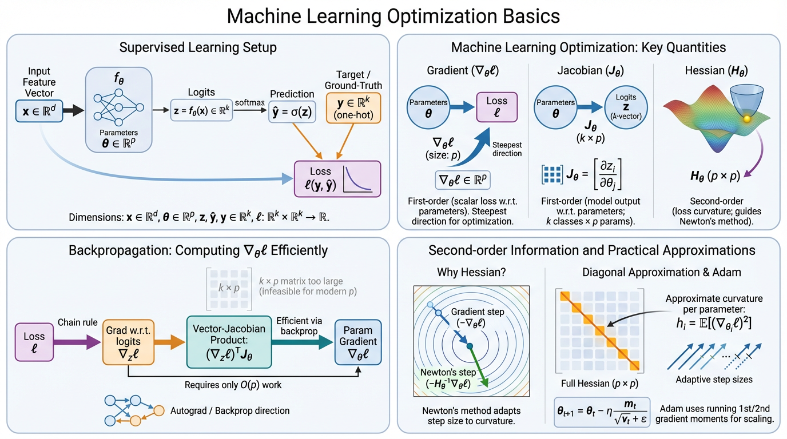

Optimization is at the core of modern machine learning.
Training a neural network typically involves minimizing a loss function using gradient-based optimization methods such as stochastic gradient descent or Adam.
In this post, let's review the basic mathematical objects behind these algorithms: gradients, Jacobians and Hessians.

<!--

Generated by <a href="https://chat.figurelabs.ai/chat?agent=3">FigureLabs</a>, prompted by this post.

-->

::: {.callout-note collapse="true" icon="false" title="1. Setup"}
Consider a model $f_\theta$ trained via supervised learning to classify inputs $x$ into $k$ classes.
The model produces logits $z = f_\theta(x) \in \mathbb{R}^k$, which are converted into predicted class probabilities via the softmax function: $\hat{y} = \sigma(z) \in \mathbb{R}^k$.
The ground-truth label is represented as a one-hot vector $y$.
Training finds parameters that minimize a loss between predicted and ground-truth labels over a dataset:
$\theta^* = \arg\min_{\theta} \sum_{n=1}^{N} \ell(y_n, \hat{y}_n)$.

**Dimensions:**

- $x \in \mathbb{R}^{d}$
- $\theta \in \mathbb{R}^{p}$
- $z, \hat{y}, y \in \mathbb{R}^k$
- $\ell: \mathbb{R}^k \times \mathbb{R}^k \to \mathbb{R}$
:::

---

::: {.callout-note collapse="true" icon="false" title="2. Gradients, Jacobians and Hessians"}
Solving the optimization requires understanding how the loss and model outputs change as parameters move through $\mathbb{R}^p$.
Three mathematical objects characterize this:

- the **Gradient** $\nabla_\theta \ell \in \mathbb{R}^p$ (first-order change of the (scalar) loss w.r.t. (vector) $\theta$)
- the **Jacobian** $J_\theta \in \mathbb{R}^{k \times p}$ (first-order change of the (vector) logits w.r.t. (vector) $\theta$)
- the **Hessian** $H_\theta \in \mathbb{R}^{p \times p}$ (second-order change of the (scalar) loss w.r.t. (vector) $\theta$)

---

**Gradient**

The gradient $\nabla_\theta \ell(y, f_\theta(x)) \in \mathbb{R}^p$ measures how the loss changes with each parameter.
It points in the direction of steepest increase of the loss.
Gradient descent steps in the opposite direction: $\theta_{t+1} = \theta_t - \eta \, \nabla_\theta \ell(y, f_\theta(x))$, where $\eta$ is the learning rate.

---

**Jacobian**

The Jacobian $J_\theta = \frac{\partial f_\theta(x)}{\partial \theta} \in \mathbb{R}^{k \times p}$ captures how each output logit $z_i$ changes with each parameter:

$$J_\theta = \begin{bmatrix} \frac{\partial z_1}{\partial \theta_1} & \cdots & \frac{\partial z_1}{\partial \theta_p} \\ \vdots & \ddots & \vdots \\ \frac{\partial z_k}{\partial \theta_1} & \cdots & \frac{\partial z_k}{\partial \theta_p} \end{bmatrix}$$

Its $i$-th row is $\frac{\partial z_i}{\partial \theta} \in \mathbb{R}^p$, describing the sensitivity of class $i$ to all parameters.

---

**Hessian**

The Hessian $H_\theta = \nabla_\theta^2 \ell \in \mathbb{R}^{p \times p}$ measures the curvature of the loss landscape:

$$H_\theta = \begin{bmatrix} \frac{\partial^2 \ell}{\partial \theta_1^2} & \cdots & \frac{\partial^2 \ell}{\partial \theta_1 \partial \theta_p} \\ \vdots & \ddots & \vdots \\ \frac{\partial^2 \ell}{\partial \theta_p \partial \theta_1} & \cdots & \frac{\partial^2 \ell}{\partial \theta_p^2} \end{bmatrix}$$

Large eigenvalues of $H_\theta$ indicate sharp curvature, while small eigenvalues indicate flat directions.
Computing the full Hessian is usually infeasible for modern networks due to its $p \times p$ size.
:::

---

::: {.callout-note collapse="true" icon="false" title="3. Backpropagation as a Vector–Jacobian Product"}
Gradient descent requires $\nabla_\theta \ell(y, f_\theta(x)) \in \mathbb{R}^p$, the gradient of the scalar loss w.r.t. model parameters.
By the chain rule, this is a vector-Jacobian product (VJP):
$\nabla_\theta \ell = \frac{\partial \ell}{\partial \theta} = \frac{\partial \ell}{\partial z} \frac{\partial z}{\partial \theta} = (\nabla_z \ell)^T J_\theta$
where $\nabla_z \ell \in \mathbb{R}^k$ is the gradient of the loss w.r.t. the logits,
and $J_\theta \in \mathbb{R}^{k \times p}$ is the Jacobian of the logits w.r.t. the parameters.

Backpropagation computes this VJP efficiently by traversing the computation graph in reverse, accumulating gradients layer by layer without ever materializing $J_\theta$.
This costs $O(p)$ and is achieved in a single backward pass, the same order as the forward pass.

The naive alternative would be to form $J_\theta$ explicitly row by row and then multiply.
This requires $k$ backward passes at $O(kp)$ compute, and storing the full $k \times p$ matrix in memory.
For modern networks where $p$ can be in the billions, both the $k\times$ compute overhead and the $k \times p$ memory cost make explicit Jacobian materialization infeasible.

:::

---

::: {.callout-note collapse="true" icon="false" title="4. Hessian approximations in practice"}

**Why the Hessian matters**

Vanilla gradient descent uses the same learning rate for every parameter:
$\theta_{t+1} = \theta_t - \eta \, \nabla_\theta \ell$.
However, different directions in parameter space may have very different curvature.
Ideally we would account for this using Newton's method (see [Appendix A](#appendix-a)):
$\theta_{t+1} = \theta_t - H_\theta^{-1} \nabla_\theta \ell$.
Here the inverse Hessian rescales the gradient:
steps are **larger in flat directions** and **smaller in steep ones**.
Unfortunately the Hessian $H_\theta \in \mathbb{R}^{p\times p}$ is far too large to compute or invert for modern neural networks.

---

**Diagonal curvature approximation**

A common simplification is to approximate only the diagonal of the Hessian.
This gives a per-parameter learning rate:
$\theta_{t+1,i} = \theta_{t,i} - \eta \, \frac{\nabla_{\theta_i}\ell}{\sqrt{h_i}}$, where $h_i$ estimates the curvature of parameter $i$.
For likelihood-based losses, the diagonal of the expected Hessian can be approximated using squared gradients (see [Appendix B](#appendix-b)):
$\text{diag}(\mathbb{E}[H_\theta]) \approx \mathbb{E}[(\nabla_\theta \ell)^2]$.
This makes curvature estimation possible using gradients alone!

---

**Adam**

Adam maintains running estimates of the first and second moments of the gradient:
$m_t = \beta_1 m_{t-1} + (1-\beta_1)\nabla_\theta \ell$, $v_t = \beta_2 v_{t-1} + (1-\beta_2)(\nabla_\theta \ell)^2$
and updates parameters as
$\theta_{t+1} = \theta_t - \eta \frac{m_t}{\sqrt{v_t}+\epsilon}$.
The denominator $\sqrt{v_t}$ acts as a diagonal curvature estimate,
scaling each parameter's update according to its historical gradient magnitude.
:::

---

::: {.callout-note collapse="true" icon="false" title="Appendix A: Newton's method from a Taylor expansion" #appendix-a}
The motivation for Newton's update comes from minimizing a local quadratic approximation of the loss.
Expanding $\ell(\theta)$ around $\theta_t$ via a second-order Taylor expansion:
$\ell(\theta) \approx \ell(\theta_t) + \nabla_\theta \ell^\top (\theta - \theta_t) + \frac{1}{2}(\theta - \theta_t)^\top H_\theta (\theta - \theta_t)$.
Setting the derivative of this quadratic w.r.t. $\theta$ to zero:
$\nabla_\theta \ell + H_\theta (\theta - \theta_t) = 0 \implies \theta = \theta_t - H_\theta^{-1} \nabla_\theta \ell$.
Thus, Newton's update finds the exact minimum of the local quadratic approximation in one step, rather than just following the gradient with a fixed step size.
:::

::: {.callout-note collapse="true" icon="false" title="Appendix B: Diagonal Hessian Approximation" #appendix-b}

For likelihood-based models, curvature can be approximated with squared gradients!
Starting from the normalization condition, $\int p(y|x,\theta)\, dy = 1$,
and differentiating twice w.r.t. $\theta$ (using the log-derivative trick $\nabla_\theta p = p\,\nabla_\theta \log p$ at each step) yields:
$\mathbb{E}[\nabla_\theta^2 \log p] = - \mathbb{E}\left[(\nabla_\theta \log p)(\nabla_\theta \log p)^\top\right]$.
If the training loss is the negative log-likelihood $\ell = -\log p(y|x,\theta)$.
Thus, $\mathbb{E}[H_\theta] = \mathbb{E}\left[(\nabla_\theta \ell)(\nabla_\theta \ell)^\top\right]$.
Taking the diagonal:
$\text{diag}(\mathbb{E}[H_\theta]) = \mathbb{E}[(\nabla_\theta \ell)^2]$.
Thus, the expected squared gradient per parameter provides a practical estimate of the diagonal curvature.

**Caveats**

1. Exact only for negative log-likelihood losses.
2. Uses the expected Hessian, not the local Hessian.
3. Captures only diagonal curvature.
:::

---
