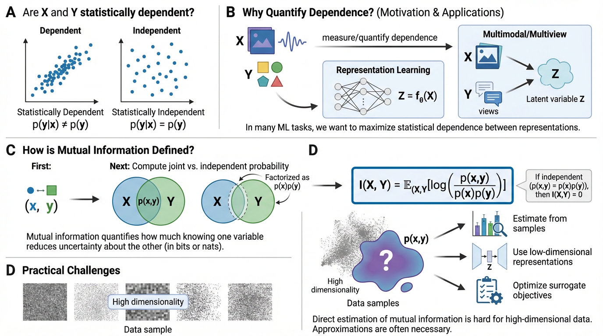

<!--

Generated by <a href="https://chat.figurelabs.ai/chat?agent=3">FigureLabs</a>, prompted by this post.

-->

::::: {.callout-note collapse="true" icon="false"}
## 1. Statistical dependence

Two random variables $X$ and $Y$ are **statistically dependent** if observing $X$ makes some values of $Y$ more or less likely, or vice versa.
Formally, this means that the conditional distribution differs from the marginal distribution, i.e. $p(y \mid x) \neq p(y)$, for some values of $x$ and $y$.

Conversely, $X$ and $Y$ are **statistically independent** if and only if $p(y \mid x) = p(y)$, for all $x$ and $y$.
Using the chain rule of probability ($p(x,y) = p(x)\,p(y \mid x)$),
this implies that the joint distribution factorizes as the product of marginals: $p(x,y) = p(x)\,p(y)$.

::: {.callout-note icon="false"}
## Summary

- **Statistical dependence**: $p(y \mid x) \neq p(y)$
- **Statistical independence**: $p(y \mid x) = p(y)$
:::
:::::

::: {.callout-note collapse="true" icon="false"}
## 2. Statistical dependence quantification - motivation

Statements like $p(y \mid x) \neq p(y)$ or $p(y \mid x) = p(y)$
tell us *whether* two variables are statistically dependent.
In many machine learning problems, however,
we are also interested in measuring (and often optimizing) the **degree of statistical dependence** between variables,
i.e. how much observing one variable changes the distribution of the other.

For instance, in representation learning,
we often want to learn features $Z = f_\theta(X)$ from an input $X$ such that $Z$ is maximally statistically dependent on $X$.
Similarly, in multi-view or multimodal input setups, we have multiple measurements of the same underlying phenomenon,
e.g. two augmented views of the same image, or images and text describing the same object.
Here, $X$ and $Y$ are different measurements of the same latent source $Z$ (e.g. the scene content or object identity).
A common goal here is to learn representations $Z_X = f_\theta(X), Z_Y = g_\phi(Y)$
such that the statistical dependence between $Z_X$ and $Z_Y$ is maximized.
:::

::: {.callout-note collapse="true" icon="false"}
## 3. Statistical dependence quantification via mutual information

Recall that statistical independence means $p(x,y) = p(x)p(y)$.
A natural way to measure the strength of dependence is therefore
to compare the true joint distribution $p(x,y)$ with the distribution that would arise under independence $p(x)p(y)$.

First, for a particular sample pair $(x,y)$, we consider the ratio $\frac{p(x,y)}{p(x)p(y)}$, which
compares how often $(x,y)$ occurs in reality to how often it would occur if the variables were independent.
Second, we take the logarithm of this ratio.
The quantity $\log \frac{p(x,y)}{p(x)p(y)}$ is sometimes called the pointwise mutual information of the pair $(x,y)$.
Finally, we average over all outcomes, weighting each pair $(x,y)$ by how frequently it occurs.
The resulting quantity is called the **mutual information** between $X$ and $Y$:

$$\boxed{I(X,Y) = \mathbb{E}_{(X,Y)}\!\left[\log \frac{p(x,y)}{p(x)p(y)}\right]}$$

If $X$ and $Y$ are independent, then $p(x,y) = p(x)p(y)$ and the ratio equals $1$ everywhere, therefore $I(X,Y) = 0$.
If not, $p(x,y) \neq p(x)p(y)$, and $I(X,Y) > 0$. This follows from recognising that MI is a KL divergence (see [appendix](#appendix)), which is always non-negative.

:::

::: {.callout-note collapse="true" icon="false"}
## 4. Mutual information as uncertainty reduction

Above, we introduced mutual information as a measure of the degree of statistical dependence between two random variables.
Here, we present an alternative view: MI measures how much information one variable provides about another, or equivalently, how much uncertainty about one variable is reduced by knowing the other.

**Probability distributions as a measure of uncertainty:**
A probability distribution over a random variable encodes our uncertainty about its value.
It tells us which outcomes are likely and which are not.
A distribution concentrated on a single value means we are near-certain,
a spread-out or uniform distribution means we are highly uncertain.
**Entropy** $H(Y) = -\mathbb{E}[\log p(Y)]$ quantifies this average uncertainty as a single number:
it is large when $p(y)$ is diffuse and small when $p(y)$ is peaked.

**Statistical dependence implies uncertainty reduction:**
When $X$ and $Y$ are statistically dependent,
observing $X = x$ shifts the distribution over $Y$ from $p(y)$ to $p(y \mid x)$,
changing how uncertain we are about $Y$.
**Conditional entropy** $H(Y \mid X) = -\mathbb{E}_{(X,Y)}[\log p(y \mid x)]$
captures the remaining uncertainty about $Y$ after observing $X$,
averaged over all possible values of $X$.

**MI as a measure of uncertainty reduction:**
Mutual information is the average reduction in uncertainty about $Y$ due to observing $X$:
$I(X, Y) = H(Y) - H(Y \mid X) = H(X) - H(X \mid Y)$.
Substituting the definitions of MI, entropy, and conditional entropy confirms this identity.

---

::: {.callout-note icon="false"}
## Summary

Three views of mutual information:

- The **strength of statistical dependence** between two variables
- The **information** one variable provides about the other
- The **reduction in uncertainty** about one variable due to knowing the other
:::

---

**Units**

The units of mutual information depend on the logarithm base (base $2$ → bits, base $e$ → nats).
Using base $2$, mutual information can be interpreted as the number of bits of uncertainty
about one variable that are reduced on average by observing the other.
For discrete variables, this has a concrete meaning:
one bit corresponds to the answer to one fair yes/no question,
so $I(X,Y) = k$ bits means observing $X$ saves you, on average, $k$ binary questions about $Y$.
For continuous variables, this interpretation breaks down.
MI can be unbounded and the absolute value in bits is not directly meaningful.
It is better treated as a relative measure, where larger MI indicates stronger dependence.

:::

::: {.callout-note collapse="true" icon="false"}
## 5. Challenges in computing mutual information

The definition above assumes that we know the joint distribution $p(x,y)$ and the marginal distributions $p(x)$ and $p(y)$.
In practice, however, these distributions are rarely known and must be estimated from samples.
This becomes particularly challenging in high dimensions.
For example, if $X$ and $Y$ are images with thousands of pixels, the joint distribution $p(x,y)$ lives in a space with thousands of dimensions.
Accurately estimating such distributions from finite data quickly becomes infeasible.
As a result, practical applications of mutual information typically rely on
approximate estimators, lower-dimensional representations, or surrogate objectives.
Three main families of approaches are used in practice:

**Non-parametric estimators:**
Methods such as the [KSG estimator](https://arxiv.org/abs/cond-mat/0305641)
compute MI directly from samples using $k$-nearest-neighbour distances in the joint space,
without assuming a parametric form for the distributions.
These are accurate in low dimensions but scale poorly as dimensionality grows.

**Variational lower bounds:**
Methods such as [MINE](https://arxiv.org/abs/1801.04062)
and [InfoNCE](https://arxiv.org/abs/1807.03748)
parameterise a critic network and optimise a tractable lower bound on MI
(see [appendix](#appendix-variational)).
These scale to high-dimensional continuous variables but the bound can be loose,
particularly when the true MI is large.

**Proxy objectives:**
In many machine learning applications,
MI maximisation is replaced with objectives that are easier to optimise and
are known empirically to correlate with high MI.
Contrastive losses are the most widely used,
forming the basis of self-supervised methods such as [SimCLR](https://arxiv.org/abs/2002.05709).
These do not produce an estimate of the MI value but are computationally practical at scale.
:::

::: {.callout-note collapse="true" icon="false"}
## Appendix: MI as a KL divergence {#appendix}

The **KL divergence** from distribution $q$ to distribution $p$ is defined as:

$$D_{\mathrm{KL}}(p \,\|\, q) = \mathbb{E}_{p}\!\left[\log \frac{p(x)}{q(x)}\right]$$

It measures how different $p$ is from $q$, and satisfies $D_{\mathrm{KL}}(p \,\|\, q) \geq 0$,
with equality if and only if $p = q$.

Mutual information is exactly the KL divergence
from the product of marginals $p(x)p(y)$ to the joint $p(x,y)$:

$$I(X,Y) = \mathbb{E}_{(X,Y)}\!\left[\log \frac{p(x,y)}{p(x)p(y)}\right] = D_{\mathrm{KL}}(p(x,y) \,\|\, p(x)p(y))$$

Non-negativity of KL divergence therefore implies $I(X,Y) \geq 0$,
with equality if and only if $p(x,y) = p(x)p(y)$, i.e. when $X$ and $Y$ are independent.
:::

::: {.callout-note collapse="true" icon="false"}
## Appendix: Variational lower bounds on MI {#appendix-variational}

Because MI cannot be computed directly in high dimensions,
a common strategy is to train a critic network $T_\theta(x,y)$
to estimate the log pointwise MI ratio $\log \frac{p(x,y)}{p(x)p(y)}$ at every pair $(x,y)$.
Once the critic is accurate,
averaging its outputs over samples from the joint gives an estimate of MI.
The critic is trained by contrasting
positive pairs $(x,y) \sim p(x,y)$ (pairs that actually co-occur) against
negative pairs $(x,y') \sim p(x)p(y)$ (independently sampled, so statistically independent by construction).
MINE and InfoNCE differ in the loss used to learn this contrast.

:::